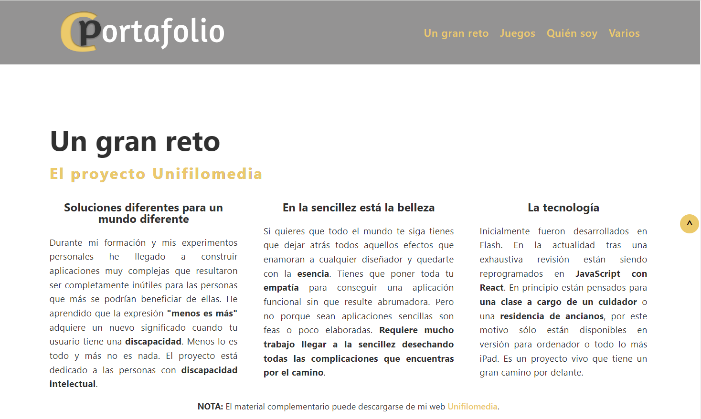
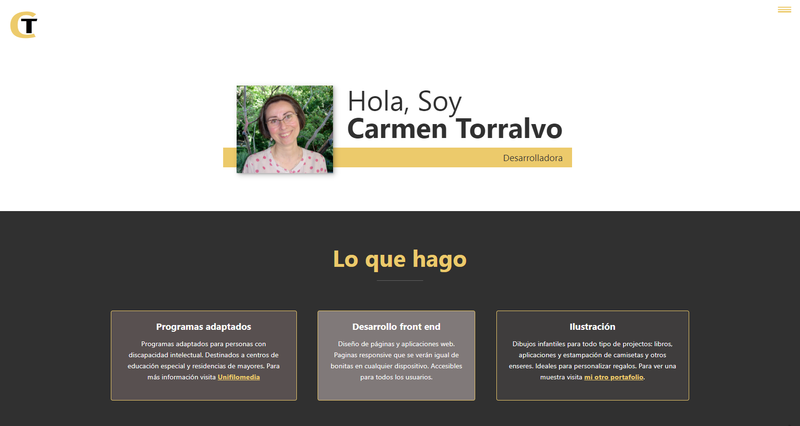

# 👋 Hi, I’m Mamen

<h3 align="center">Languages and Tools:</h3>
<a href="https://img.shields.io/badge/:JavaScript">

        

## About me 

I love programming, drawing and writing. I have always been very aware of people with special educational needs. In 2008 I received the <strong>Entrepreneur award</strong> from the community of Madrid for my project, <a href="https://www.unifilomedia.net" target="_blank">Unifilomedia.</a>

Committed to people with disabilities. I contributed to the edition for the promotion of services dedicated to low vision of the EBU <a href="https://www.youtube.com/watch?v=NgXyK9dwrkc!" target="_blank">Promote low vision services</a>

<ul>
  <li> 👀 I’m interested in web development.</li>
  <li> 🌱 I’m currently learning html5, CSS, and JavaScript.</li>
  <li> 💞️ I’m looking for collaborating on web development projects.</li>
  <li> 📫 How to reach me. Well. Mail me at carmentdeveloper@gmail.com.</li>
 </ul>

<!---
Amapola-Negra/Amapola-Negra is a ✨ special ✨ repository because its `README.md` (this file) appears on your GitHub profile.
You can click the Preview link to take a look at your changes.
--->
## Education

&nbsp;&nbsp;&nbsp;&nbsp;&nbsp;&nbsp;&nbsp;&nbsp;&nbsp;
 

### Certifications
|               |               |
| ------------- | ------------- |
|
<strong>2004 Comunidad de Madrid</strong>  <a href="Certifications/LENGUAJE-PROGRAMACIÓN-2004.pdf" target="_blank">Lenguajes de programación</a>
|
<strong>2005 Comunidad de Madrid </strong><a href="Certifications/LENGUAJES-PROGRAMACIÓN-2005.pdf">Lenguajes de programación</a>
|
|
<strong>2017 Google Activate</strong> <a href="Certifications/DIPLOMA MÁRKETING DIGITAL.pdf" target="_blank">Curso Básico de Marketing Digital</a>
|
<strong>2017 Google Activate</strong> <a href="Certifications/Curso de Introducción al Desarrollo Web_ HTML y CSS (1_2).pdf" target="_blank">Introducción al desarrollo web</a>
|
|
<strong>2017 Google Activate</strong> <a href="Certifications/Curso de Productividad Personal en la Era Digital - certificado.pdf">Productividad personal en la era digital</a>
|
<strong>2021 FreeCodeCamp</strong> <a href="https://www.freecodecamp.org/certification/fcc6967a336-8a89-485b-b015-6105aa2dbfb7/responsive-web-design" target="_blank" text-align="center">Responsive Web Design</a>
|
|
<strong>2021 FreeCodeCamp</strong> <a href="https://www.freecodecamp.org/certification/fcc6967a336-8a89-485b-b015-6105aa2dbfb7/javascript-algorithms-and-data-structures">JavaScript Algorithms and Data Structures</a>
|
<strong>2023 Scrimba</strong> <a href="https://scrimba.com/certificate/u4P49NAY/gjavascript" target="_blank">JavaScript Deep Dive</a>
|
|
<strong>2023 Scrimba</strong> <a href="https://scrimba.com/certificate/u4P49NAY/greact" target="_blank">Advanced React</a>
|
<strong>2023 Scrimba</strong> <a href="https://scrimba.com/certificate/u4P49NAY/gfrontend" target="_blank">The Frontend Developer Career Path</a>
|

## Portfolio 2024

## Portfolio

## Imaginary Portfolio

