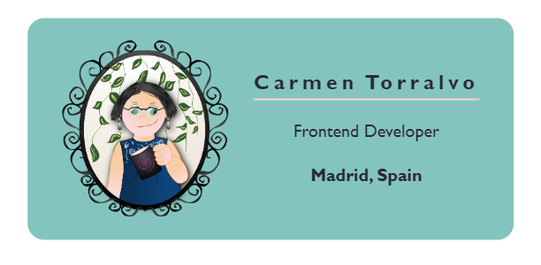
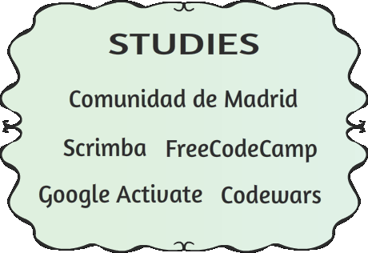
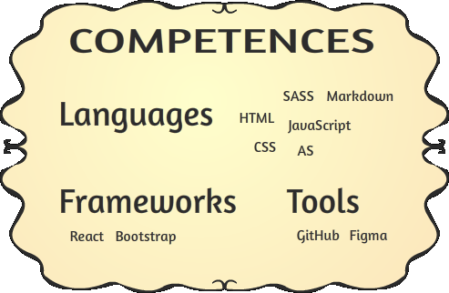
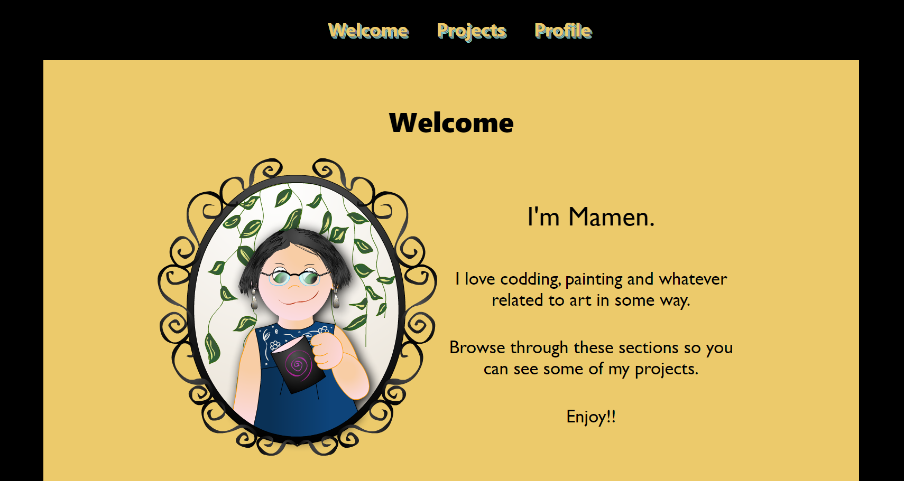

# 👋 Hi, I’m Mamen

## About me 

I love programming, drawing and writing. I have always been very aware of people with special educational needs. In 2008 I received the Entrepreneur award from the community of Madrid for my project, <a href="https://www.unifilomedia.net" target="_blank">Unifilomedia.</a>

<ul>
  <li> 👀 I’m interested in web development.</li>
  <li> 🌱 I’m currently learning html5, CSS, and JavaScript.</li>
  <li> 💞️ I’m looking for collaborating on web development projects.</li>
  <li> 📫 How to reach me. Well. You can send me a messagge through this channel.</li>
 </ul>

<!---
Amapola-Negra/Amapola-Negra is a ✨ special ✨ repository because its `README.md` (this file) appears on your GitHub profile.
You can click the Preview link to take a look at your changes.
--->
## Education

&nbsp;&nbsp;&nbsp;&nbsp;&nbsp;&nbsp;&nbsp;&nbsp;&nbsp;
 

### Certifications
| FreeCodeCamp | Google Activate |Comunidad de Madrid
| ------------- | ------------- |------------- |
| <a href="https://www.freecodecamp.org/certification/fcc6967a336-8a89-485b-b015-6105aa2dbfb7/responsive-web-design">Responsive Web Design</a>  | <a href="Certifications/Curso de Productividad Personal en la Era Digital - certificado.pdf">Productividad personal en la era digital</a> |<a href="Certifications/LENGUAJE-PROGRAMACIÓN-2004.pdf">Lenguajes de programación 2004</a>|
| <a href="https://www.freecodecamp.org/certification/fcc6967a336-8a89-485b-b015-6105aa2dbfb7/javascript-algorithms-and-data-structures">JavaScript Algorithms and Data Structures</a> | <a href="Certifications/Curso de Introducción al Desarrollo Web_ HTML y CSS (1_2).pdf">Introducción al desarrollo web</a>|<a href="Certifications/LENGUAJES-PROGRAMACIÓN-2005.pdf">Lenguajes de programación 2005</a>|
  |             |  <a href="Certifications/DIPLOMA MÁRKETING DIGITAL.pdf">Márketing Digital</a>             ||<a href="Certifications/LENGUAJE-PROGRAMACIÓN-2004.pdf">Lenguajes de programación 2004</a>|

## Portfolio

